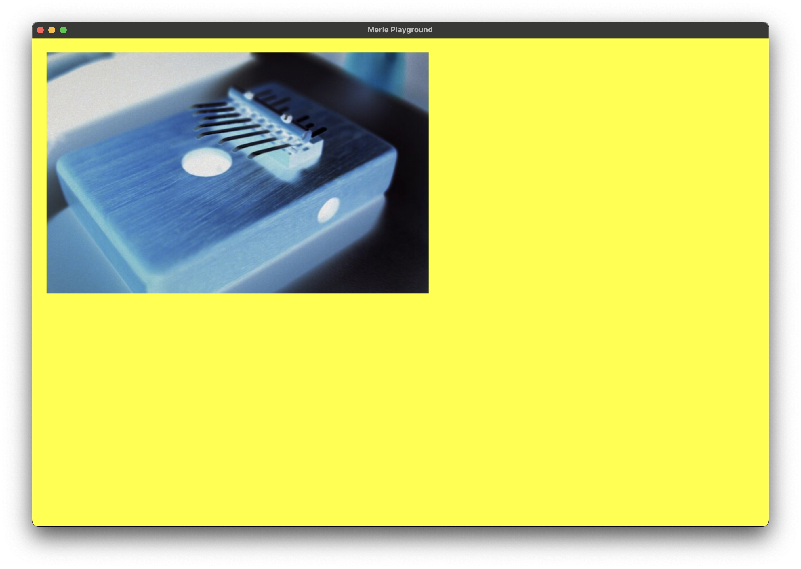

# Filter Library

## Color Filters

Color filters manipulate each pixel in isolation.

### Clear

Clears one or more channels of an existing image with a particular color.

| Argument | Description|
|-|-|
|`color`|The color to use to clear the image.|
|`clear_red`| If the red channel of the image should be cleared.|
|`clear_green`| If the green channel of the image should be cleared.|
|`clear_blue`| If the blue channel of the image should be cleared.|
|`clear_alpha`| If the alpha channel of the image should be cleared.|

### Grayscale

Converts the RGB channels of an image to grayscale. This filter takes no arguments.

### Invert

Inverts the RGB channels of an image. This filter takes no arguments.

### Exposure

Update the exposure of the image.

| Argument | Description|
|-|-|
|`exposure`|The exposure adjustment to apply. `0` specifies no change. `-2` to `2` is a recommended range to supply.|

### Brightness

Update the brightness of the image.

| Argument | Description|
|-|-|
|`brightness`|The brightness adjustment to apply. `0` specifies no change. `0` to `1` is a recommended range to supply.|

### RGBA Levels

Adjust the levels of the individual channels of the image.

| Argument | Description|
|-|-|
|`red`|The adjust to the red channel of the image. `1` specifies no change. `0` to `1` is a recommended range to supply.|
|`green`|The adjust to the green channel of the image. `1` specifies no change. `0` to `1` is a recommended range to supply.|
|`blue`|The adjust to the blue channel of the image. `1` specifies no change. `0` to `1` is a recommended range to supply.|
|`alpha`|The adjust to the alpha channel of the image. `1` specifies no change. `0` to `1` is a recommended range to supply.|

### Swizzle

Copy the data from one channel to another. Multiple channels may be copied in one shot allowing channel swizzling.

| Argument | Description|
|-|-|
|`red`|The component to copy the red channel to.|
|`green`|The component to copy the green channel to.|
|`blue`|The component to copy the blue channel to.|
|`alpha`|The component to copy the alpha channel to.|

### Sepia

Apply [sepia toning](https://en.wikipedia.org/wiki/Sepia_(color)) to the image. This filter takes no arguments.

### Contrast

Adjust the contrast of an image.

| Argument | Description|
|-|-|
|`contrast`|The contrast adjustment to apply. `1.0` specifies no adjustment. `0.0` to `4.0` is a recommended range.|

### Saturation

Increase or decrease the saturation of an image.

| Argument | Description|
|-|-|
|`saturation`|The saturation adjustment to apply. `0.0` specifies no adjustment. `-1.0` to `1.0` is a recommended range.|

### Vibrance

Adjust the vibrance of the image

| Argument | Description|
|-|-|
|`vibrance`|The saturation adjustment to apply. `0.0` specifies no adjustment. `-2.0` to `2.0` is a recommended range.|

