# Filter Reference

## Color Filters

Color filters manipulate each pixel in isolation.

### Clear

Clears one or more channels of an existing image with a particular color.

| Argument | Description|
|-:|-|
|`color`|The color to use to clear the image.|
|`clear_red`| If the red channel of the image should be cleared.|
|`clear_green`| If the green channel of the image should be cleared.|
|`clear_blue`| If the blue channel of the image should be cleared.|
|`clear_alpha`| If the alpha channel of the image should be cleared.|

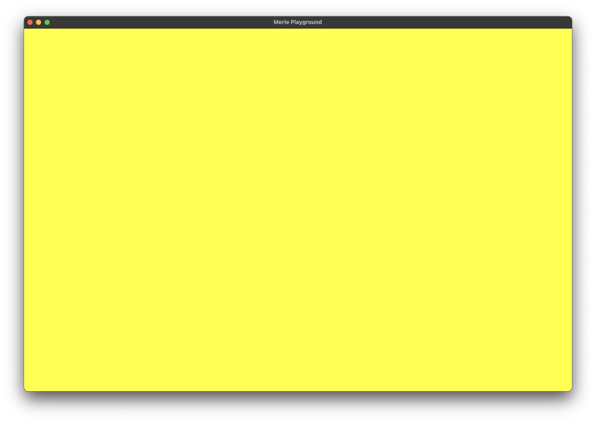
### Grayscale

Converts the RGB channels of an image to grayscale. This filter takes no arguments.
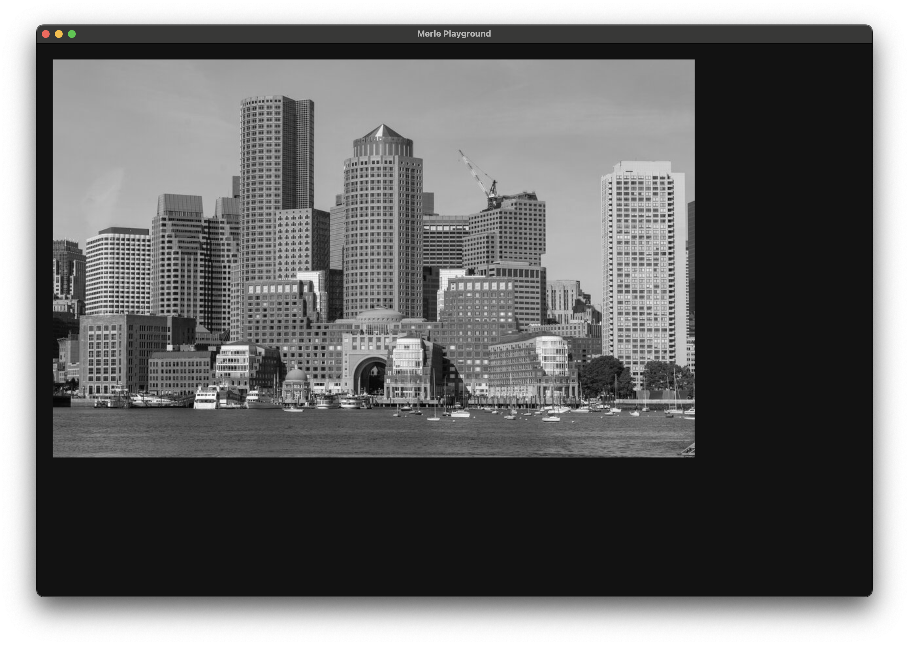
### Invert

Inverts the RGB channels of an image. This filter takes no arguments.
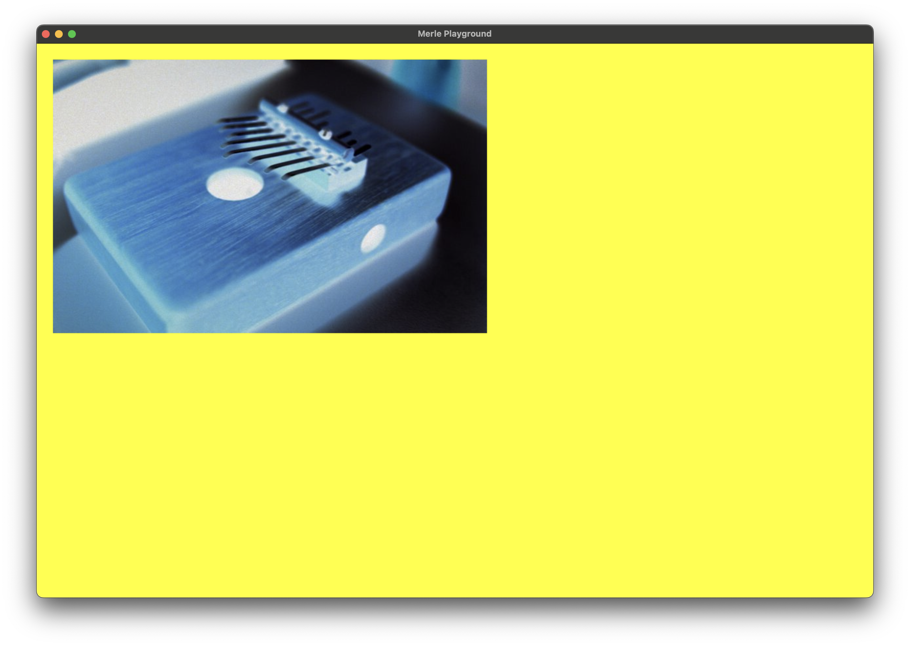

### Exposure

Update the exposure of the image.

| Argument | Description|
|-:|-|
|`exposure`|The exposure adjustment to apply. `0` specifies no change. `-2` to `2` is a recommended range to supply.|

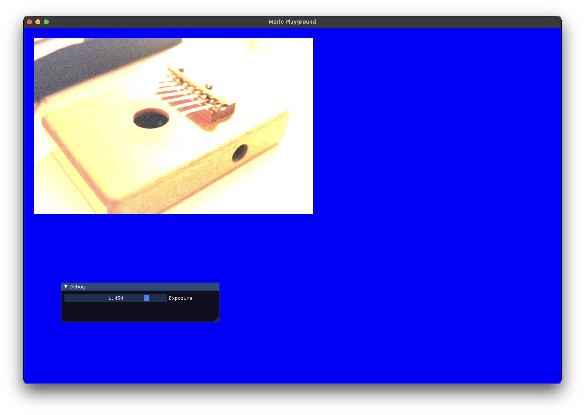
### Brightness

Update the brightness of the image.

| Argument | Description|
|-:|-|
|`brightness`|The brightness adjustment to apply. `0` specifies no change. `0` to `1` is a recommended range to supply.|

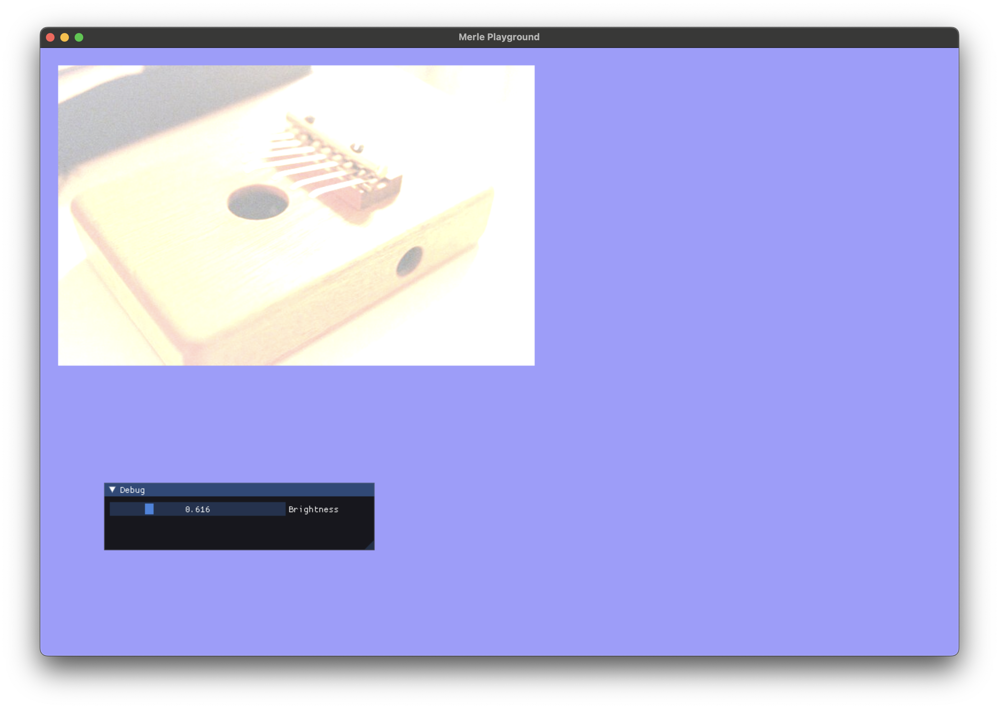

### RGBA Levels

Adjust the levels of the individual channels of the image.

| Argument | Description|
|-:|-|
|`red`|The adjust to the red channel of the image. `1` specifies no change. `0` to `1` is a recommended range to supply.|
|`green`|The adjust to the green channel of the image. `1` specifies no change. `0` to `1` is a recommended range to supply.|
|`blue`|The adjust to the blue channel of the image. `1` specifies no change. `0` to `1` is a recommended range to supply.|
|`alpha`|The adjust to the alpha channel of the image. `1` specifies no change. `0` to `1` is a recommended range to supply.|

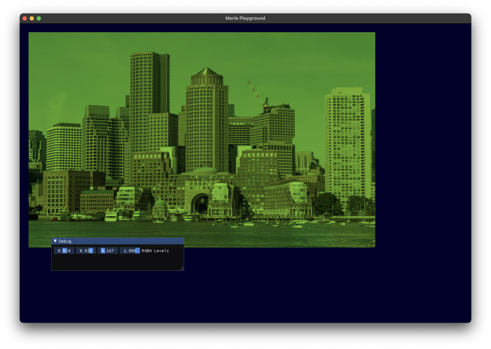

### Swizzle

Copy the data from one channel to another. Multiple channels may be copied in one shot allowing channel swizzling.

| Argument | Description|
|-:|-|
|`red`|The component to copy the red channel to.|
|`green`|The component to copy the green channel to.|
|`blue`|The component to copy the blue channel to.|
|`alpha`|The component to copy the alpha channel to.|

### Sepia

Apply [sepia toning](https://en.wikipedia.org/wiki/Sepia_(color)) to the image. This filter takes no arguments.

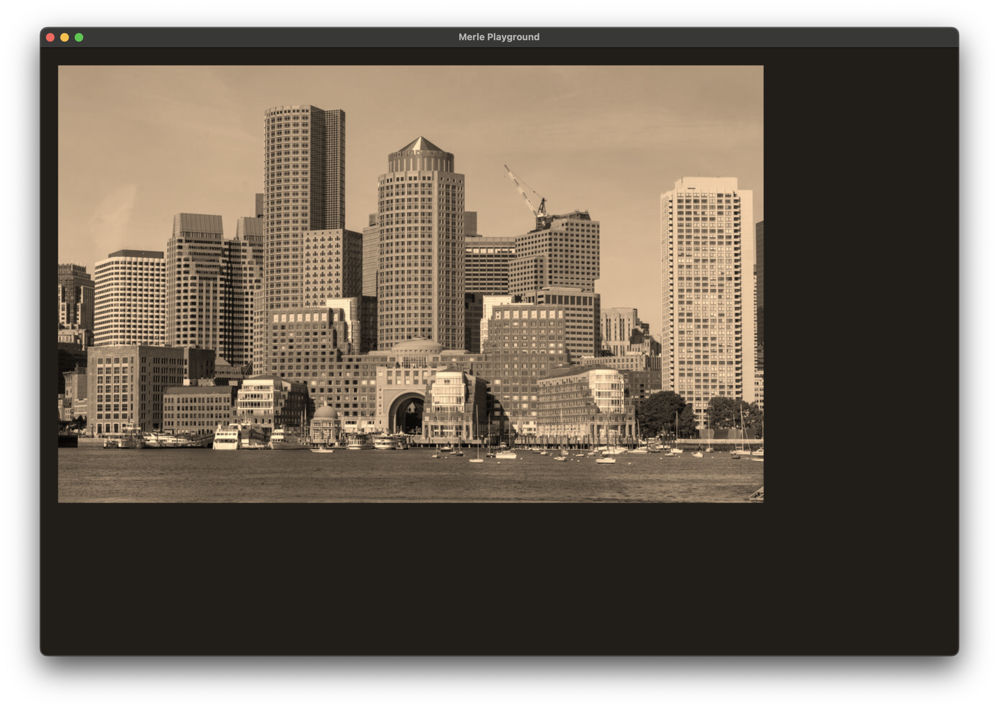

### Contrast

Adjust the contrast of an image.

| Argument | Description|
|-:|-|
|`contrast`|The contrast adjustment to apply. `1.0` specifies no adjustment. `0.0` to `4.0` is a recommended range.|

### Saturation

Increase or decrease the saturation of an image.

| Argument | Description|
|-:|-|
|`saturation`|The saturation adjustment to apply. `0.0` specifies no adjustment. `-1.0` to `1.0` is a recommended range.|

### Vibrance

Adjust the vibrance of the image.

| Argument | Description|
|-:|-|
|`vibrance`|The saturation adjustment to apply. `0.0` specifies no adjustment. `-2.0` to `2.0` is a recommended range.|

### Hue

The angle of adjustment of the hue of the image.

| Argument | Description|
|-:|-|
|`hue`|The angle of adjustment of the hue of the image.|

### Opacity

Set the opacity of an image.

| Argument | Description|
|-:|-|
|`opacity`|The new opacity of the image. The values must be between `0.0` and `1.0`.|

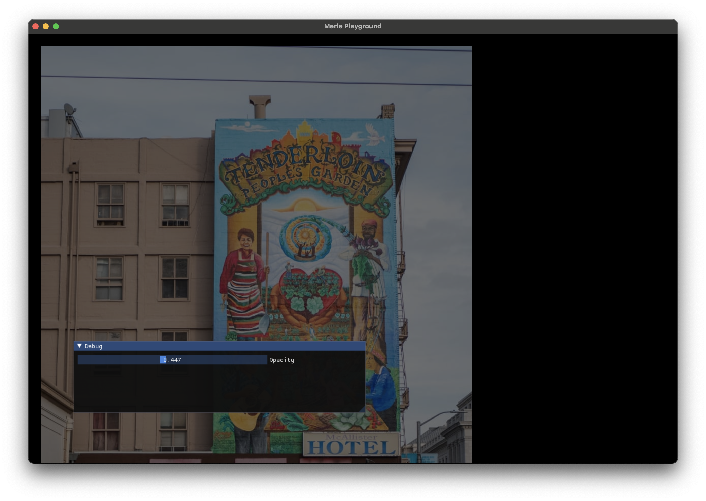

### Luminance Threshold

Given a specific luminance value, set values of pixels less than that value to opaque black, and the others to opaque white.

| Argument | Description|
|-:|-|
|`luminance`|The luminance threshold. The values must be between `0.0` and `1.0`.|

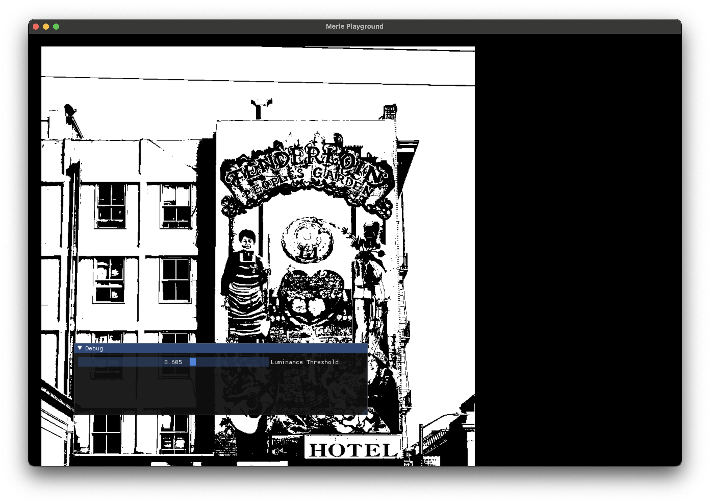

## Image Filters

Image filters apply adjustment to groups of pixels.

### Box Blur

Applies a filter that averages the pixel values around each pixel. The "radius" is the half-width of the box enclosing the pixel being sampled. The width and height of the box equals `2 * radius + 1`. So increasing the size of the radius quickly increasing the number of pixels being sampled and things get expensive fast!

Box blurs are not in-place filters. The source and destination textures must be different.

An edge of `radius` pixels remains undefined in the destination image.

| Argument | Description|
|-:|-|
|`src`|The source texture to sample pixels from. The size of the `src` texture and the destination texture must match exactly.|
|`radius`|The half-width of the box surrounding the pixel.|

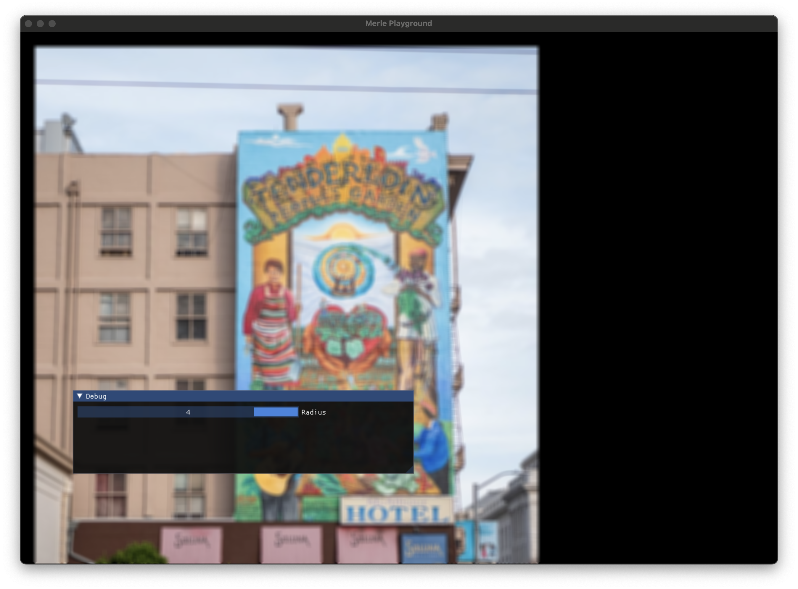

### Gaussian Blur

Applies a [Gaussian blur](https://en.wikipedia.org/wiki/Gaussian_blur) on the pixel values sampled from a box surrounding each pixel. The "radius" is the half-width of the box enclosing the pixel being sampled. The width and height of the box equals `2 * radius + 1`. So increasing the size of the radius quickly increasing the number of pixels being sampled and things get expensive fast!

Gaussian blurs are not in-place filters. The source and destination textures must be different.

An edge of `radius` pixels remains undefined in the destination image.

| Argument | Description|
|-:|-|
|`src`|The source texture to sample pixels from. The size of the `src` texture and the destination texture must match exactly.|
|`radius`|The half-width of the box surrounding the pixel.|
|`sigma`|The standard deviation of the Gaussian function.|

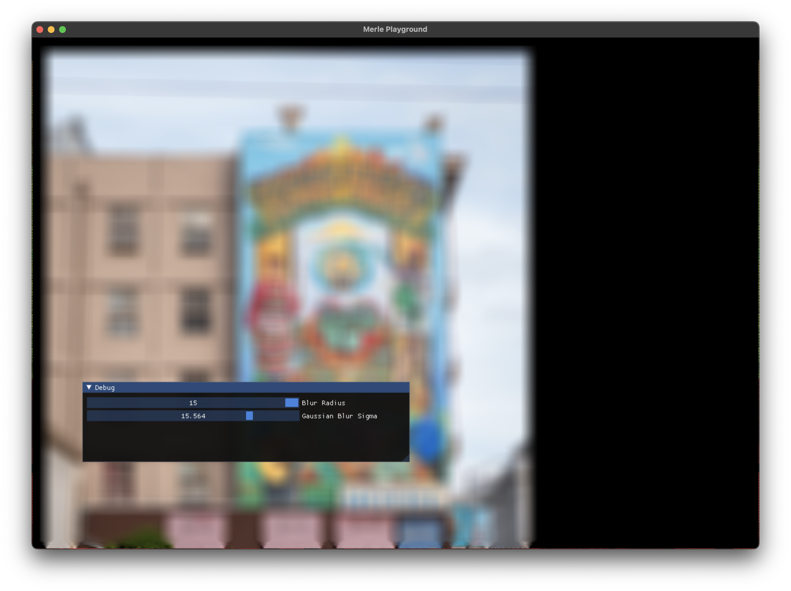

### Sobel Filter

Finds the edges in an image as determined using the [Sobel operator](https://en.wikipedia.org/wiki/Sobel_operator). This filter runs two 3x3 convolution filters on a single image channel.

Sobel filters run on grayscale images. For this reason, it is possible to select a specific channel in the source image to use as the grayscale component. The target of the Sobel operation can also be directed to a specific channel.

Sobel filters are not in-place filters. The source and destination channels must be different. Unlike convolution kernels that operate on multiple components, it is possible to apply the filter to one channel of an image and store the results into another channel of the same image.

Since these filters operate on a single channel, it is usually necessary to duplicate destination channel across the remaining components to get a true grayscale image. Since the source channel is grayscale, it is also usually necessary to apply the grayscale filter to the source image.

| Argument | Description|
|-:|-|
|`src`|The source texture to sample pixels from. The size of the `src` texture and the destination texture must match exactly.|
|`src_component`|The component in the source texture to use as the grayscale component.|
|`dst_component`|The component in the destination texture to direct the result of the Sobel operation to.|

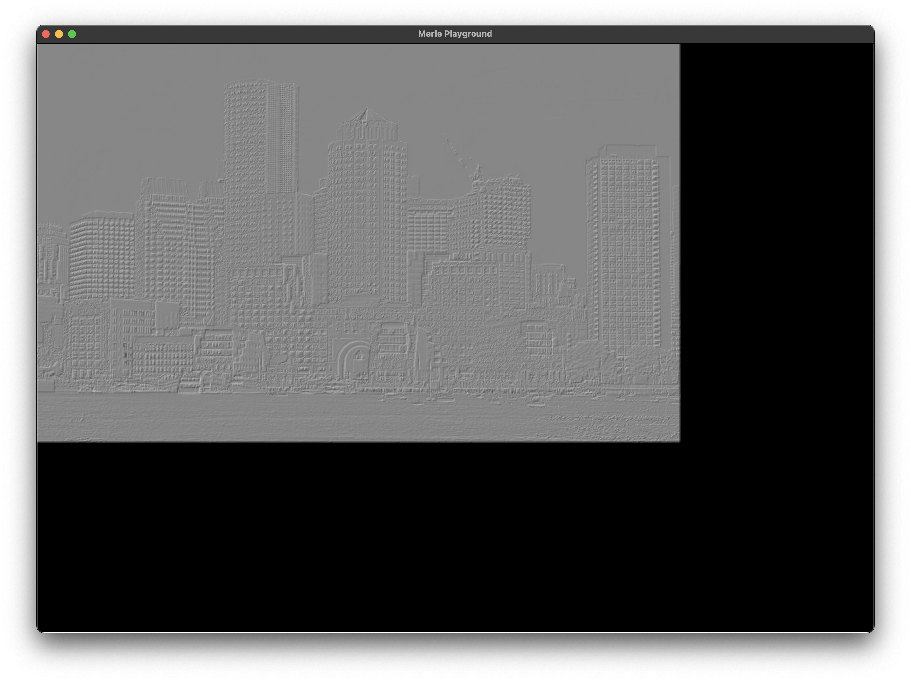
